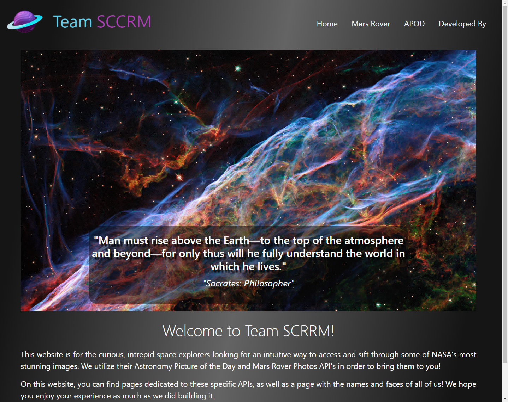

# Team-SCCRM

## Description

We created this website as a way to combine 2 of NASA's popular API's that provide photos from the Mars Rovers and the Astronomy Picture of the Day. The intended user is one who appreciates photos of/about/from space who wants easier access to up-to-date NASA photos. Our website uses an intuitive and responsive design in order to deliver the easiest experience for users searching or browsing through these images. 

## Collaborators:

- <a href="https://github.com/Elrond-Hubbard">Michael Marsolo</a>
- <a href="https://github.com/ChrisDeHaan">Christopher DeHaan</a>
- <a href="https://github.com/Bunde20">Steven Bunde</a>
- <a href="https://github.com/CambiG1123">Campbell Gilliland</a>
- <a href="https://github.com/RachelCodes42">Rachel Hochman</a>

## Deployed Link

https://chrisdehaan.github.io/Team-SCCRM/

## Mock-Ups

### Mobile:

### Web:

## Technologies Used

- Bootstrap v5.3
- JQuery v3.7.0
- DayJS
- Midjourney

## References

- <a href="https://developer.mozilla.org/en-US/">MDN web docs</a>
- <a href ="https://www.w3schools.com/">w3 schools</a>
- <a href ="https://api.nasa.gov/">NASA API wesbite</a>
- <a href ="https://stackoverflow.com/questions/10805125/how-to-remove-all-line-breaks-from-a-string">Removing line breaks from a string</a>
- <a href ="https://stackoverflow.com/questions/8710442/how-to-specify-multiple-conditions-in-an-if-statement-in-javascript">Multiple conditions in if statement</a>
- <a href ="https://developer.mozilla.org/en-US/docs/Web/API/Window/error_event">addEventListener error event</a>
- <a href ="https://stackoverflow.com/questions/10422949/css-background-opacity">rgba explanation and use</a>
- <a href ="https://www.amitmerchant.com/shine-animation-on-hover-using-css/">shine effect</a>
- <a href ="https://www.w3schools.com/howto/tryit.asp?filename=tryhow_css_image_overlay_opacity">centering caption in image</a>
- <a href ="https://spacequotations.com/quotes-about-space/">quotes</a>
- <a href ="http://www.seasky.org/quotes/space-quotes-astronomy.html">more quotes</a>

## License

Refer to license in repo.